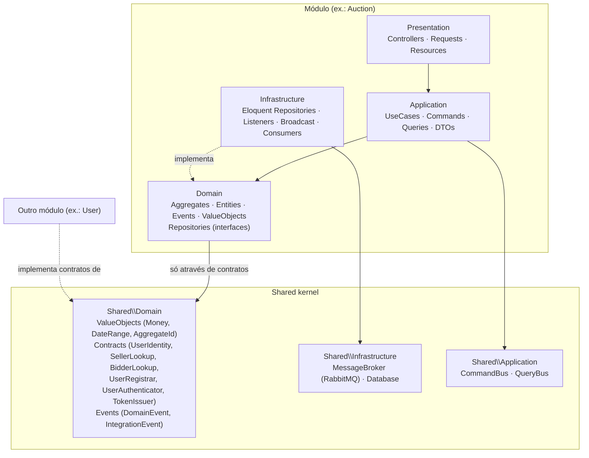

# BidFlow API

Backend de um sistema de leilão em tempo real, construído como projeto de portfólio para demonstrar **DDD + Clean Architecture + arquitetura orientada a eventos + bidding em tempo real via WebSocket** em Laravel.

O frontend (React) é um repositório separado — este projeto cobre apenas a API e a infraestrutura de eventos/WebSocket que a alimentam.

> Este README é escrito incrementalmente, fase a fase, junto com o código. Seções marcadas como pendentes serão preenchidas conforme o respectivo módulo é construído — veja o [índice de ADRs](#índice-de-adrs) e o histórico de commits para o estado exato de cada fase.

## Objetivo

Mostrar, em um sistema funcional de leilões com lances em tempo real, como estruturar um monólito modular em Laravel com:

- Módulos isolados por domínio de negócio (vertical slices), comunicando-se apenas através de contratos publicados no *shared kernel*.
- Separação de camadas por módulo (Domain / Application / Infrastructure / Presentation), com a camada de domínio livre de dependências do framework.
- Eventos de domínio traduzidos para eventos de integração, publicados em um message broker (RabbitMQ) e consumidos por processos independentes.
- Lances em tempo real via WebSocket (Laravel Reverb), com concorrência tratada por lock pessimista dentro de transações de banco.

## Stack

| Camada | Tecnologia |
|---|---|
| Linguagem / Framework | PHP 8.3+, Laravel (última versão estável) |
| Banco de dados | PostgreSQL 16 |
| Cache / filas internas | Redis + Horizon |
| Mensageria (integration events) | RabbitMQ (exchange topic, pub/sub) |
| WebSocket | Laravel Reverb |
| Autenticação | Laravel Sanctum (token, não cookie-SPA) |
| Testes | Pest (+ plugins Laravel, Arch, Faker) |
| Análise estática | Larastan / PHPStan (nível 6+) |
| Documentação de API | Scramble (OpenAPI 3.1 gerado a partir do código) |
| Infraestrutura local | Docker Compose (customizado, não Sail) |

Ver ADR-0009 *(pendente — Fase 5)* para a justificativa da separação entre filas internas (Redis/Horizon) e integration events (RabbitMQ).

## Arquitetura

*(Seção consolidada progressivamente; ver também os diagramas específicos linkados nas ADRs de cada fase.)*

### Estrutura de módulos

```
src/
├── Modules/{Auction,User,Notification,Dashboard,Auth}/
│   ├── Domain/          # Entities, Aggregates, Events, Exceptions, Repositories (interfaces), Services, ValueObjects
│   ├── Application/     # DTOs, UseCases, Commands, Queries
│   ├── Infrastructure/  # Persistence, Repositories (implementações), Listeners, Broadcast, Console/Consumers
│   ├── Presentation/    # Controllers, Requests, Resources
│   └── Providers/       # {Module}ServiceProvider.php
└── Shared/
    ├── Domain/          # ValueObjects, Events (contratos DomainEvent/IntegrationEvent), Contracts (UserIdentity, SellerLookup, BidderLookup)
    ├── Infrastructure/  # MessageBroker (RabbitMQ), Database (helpers de transação)
    └── Application/     # CommandBus/QueryBus (implementação própria, sem pacote de terceiros)
```

**Regra de fronteira entre módulos**: um módulo só pode depender de outro módulo através de contratos publicados em `Shared\Domain`, nunca das classes internas de outro módulo. Essa regra é garantida por um teste de arquitetura (`tests/Architecture/BoundariesTest.php`), rodado no CI.

`Bid` mora dentro de `Modules/Auction/Domain` como entidade filha do aggregate `Auction` — não é um módulo/aggregate próprio, já que não tem ciclo de vida independente de um leilão.

### Diagrama de camadas

Fluxo de dependência dentro de um módulo (Presentation → Application → Domain; Infrastructure → Domain). `Shared\Domain` é o único ponto de contato permitido entre módulos — nunca uma seta direta de `Modules\X` para `Modules\Y`.



`Shared\Domain` não depende de `Illuminate\*` nem de exceções genéricas — ver [ADR-0003](docs/adr/0003-shared-kernel-contracts.md) para o racional completo do shared kernel.

### Fluxo de lance

*(pendente — Fase 4)*

### Fluxo de eventos (domain → integration → broadcast)

*(pendente — Fase 5)*

### Estratégia WebSocket

*(pendente — Fase 7)*

## Modelo de domínio

*(pendente — Fase 3: invariantes do aggregate `Auction`)*

## Fluxo de Auth

Autenticação via **token Sanctum** (não cookie-SPA) — ver [ADR-0004](docs/adr/0004-auth-token-sanctum.md) para o racional completo.

```
POST /api/register  { name, email, password, password_confirmation } → 201 { user, token }
POST /api/login      { email, password }                              → 200 { user, token }
POST /api/logout                                    (Bearer token)    → 204
GET  /api/me                                         (Bearer token)   → 200 { data: user }
```

- Todo endpoint autenticado usa `auth:sanctum` + um middleware `abilities:<ability>` checando a habilidade do token.
- Vocabulário de abilities fixado nesta fase (`App\Modules\Auth\Domain\ValueObjects\TokenAbility`): `bid:place`, `profile:read`, `profile:write`, `auction:manage`, `notifications:read`. Login/registro emitem um token com todas as abilities; tokens mais restritos (ex.: uma integração só-para-lances) poderão ser emitidos depois sem precisar mudar esse vocabulário.
- Rate limit nomeado `login` (5 tentativas/minuto por `ip+email`) aplicado a `/register` e `/login`.
- Endpoints de histórico de lances/leilões ganhos/perdidos/ranking (`/api/profile/bids`, `/api/profile/auctions/won`, `/api/profile/auctions/lost`, `/api/rankings`) existem já como **stub**, retornando `{ data: [] }` — implementação real na Fase 12.

## Contrato da tela de leilão ao vivo

*(pendente — Fase 9)*

## Metodologia dos rankings

*(pendente — Fase 12)*

## Métricas do dashboard admin

*(pendente — Fase 14)*

## Dashboard técnico

*(pendente — Fase 15)*

## Rodando via Docker

Pré-requisitos: Docker + Docker Compose, nada mais — PHP e Composer rodam dentro dos containers.

```bash
git clone <repo> bidflow-api
cd bidflow-api
cp .env.example .env

# build + sobe todos os serviços
docker compose up -d --build

# instala dependências e gera a chave da aplicação
docker compose exec app composer install
docker compose exec app php artisan key:generate

# roda as migrations
docker compose exec app php artisan migrate

# expõe o disco público (avatares de usuário, fotos de leilão)
docker compose exec app php artisan storage:link

# roda a suíte de testes
docker compose exec app php artisan test

# roda a análise estática
docker compose exec app ./vendor/bin/phpstan analyse
```

A API fica disponível em `http://localhost:8000` (porta configurável via `APP_PORT` no `.env`).

### Serviços do Docker Compose

| Serviço | Papel | Porta local |
|---|---|---|
| `app` | PHP-FPM 8.3, roda a aplicação | — (interno, via nginx) |
| `nginx` | Servidor web, proxy para o `app` | `8000` |
| `postgres` | Banco de dados principal | `5433` |
| `redis` | Cache, filas internas (Horizon), read models | `6380` |
| `rabbitmq` | Broker de integration events + UI de management | `5672` / `15672` |
| `reverb` | Servidor WebSocket (Laravel Reverb) | `8080` |
| `horizon` | Worker das filas Redis (jobs internos, ex.: e-mail) | — |

> Consumers de RabbitMQ e o loop de broadcast do timer serão adicionados como serviços próprios nas fases em que forem introduzidos (ver tabela de topologia RabbitMQ, pendente — Fase 6).

## Estrutura de testes

- `tests/Unit` — testes unitários isolados.
- `tests/Feature` — testes de ponta a ponta via HTTP, rodando contra Postgres real (`bidflow_testing`), não SQLite — necessário desde já porque os testes de concorrência de lances (Fase 4) dependem de locking real do Postgres (`SELECT ... FOR UPDATE`).
- `tests/Architecture` — regras estruturais (fronteiras de módulo, camada de domínio livre de framework), via `pestphp/pest-plugin-arch`.

## Índice de ADRs

| ADR | Título |
|---|---|
| [0001](docs/adr/0001-monolito-modular.md) | Monólito modular com vertical slices |
| [0002](docs/adr/0002-clean-architecture-por-modulo.md) | Camadas de Clean Architecture por módulo |
| [0003](docs/adr/0003-shared-kernel-contracts.md) | Padrão de contrato do shared kernel |
| [0004](docs/adr/0004-auth-token-sanctum.md) | Autenticação por token Sanctum (não cookie-SPA) |

*(demais ADRs adicionadas conforme as fases avançam)*
