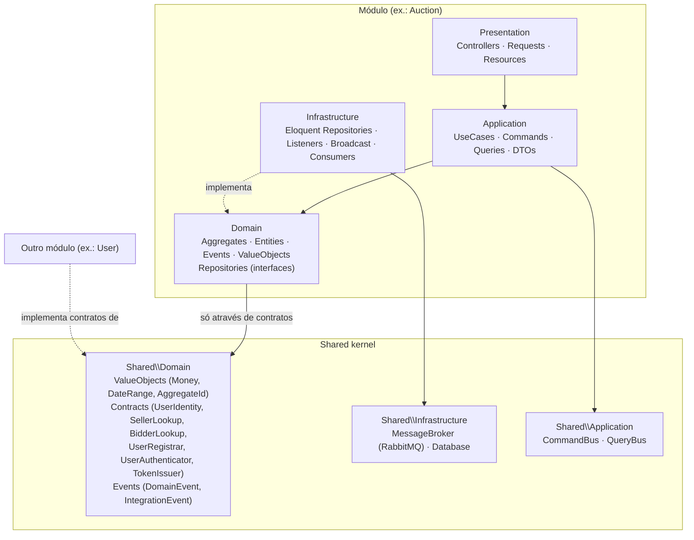
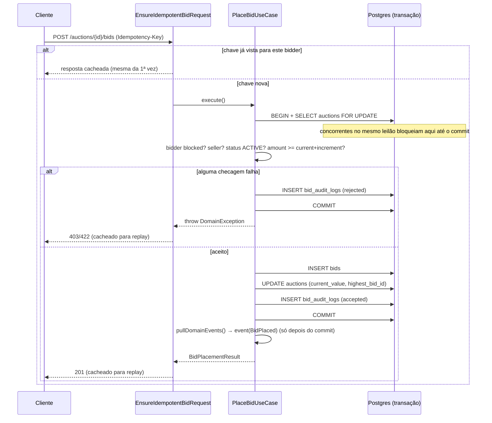
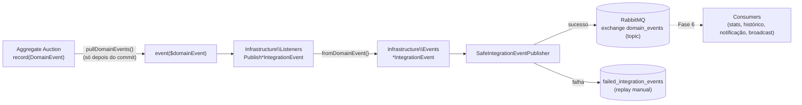

# BidFlow API

Backend de um sistema de leilão em tempo real, construído como projeto de portfólio para demonstrar **DDD + Clean Architecture + arquitetura orientada a eventos + bidding em tempo real via WebSocket** em Laravel.

O frontend (React) é um repositório separado — este projeto cobre apenas a API e a infraestrutura de eventos/WebSocket que a alimentam.

> Este README foi escrito incrementalmente, fase a fase, junto com o código — 16 fases, 20 ADRs, cada uma testada, documentada e validada com infraestrutura real antes de seguir para a próxima (ver o histórico de commits para o estado exato de cada fase). Para uma leitura guiada do sistema inteiro em vez de seção por seção, veja [docs/architecture-walkthrough.md](docs/architecture-walkthrough.md); para a API REST, `GET /docs` (Redoc, self-hosted) ou [docs/openapi.yaml](docs/openapi.yaml) diretamente.

## Objetivo

Mostrar, em um sistema funcional de leilões com lances em tempo real, como estruturar um monólito modular em Laravel com:

- Módulos isolados por domínio de negócio (vertical slices), comunicando-se apenas através de contratos publicados no *shared kernel*.
- Separação de camadas por módulo (Domain / Application / Infrastructure / Presentation), com a camada de domínio livre de dependências do framework.
- Eventos de domínio traduzidos para eventos de integração, publicados em um message broker (RabbitMQ) e consumidos por processos independentes.
- Lances em tempo real via WebSocket (Laravel Reverb), com concorrência tratada por lock pessimista dentro de transações de banco.

## Stack

| Camada | Tecnologia |
|---|---|
| Linguagem / Framework | PHP 8.3+, Laravel (última versão estável) |
| Banco de dados | PostgreSQL 16 |
| Cache / filas internas | Redis + Horizon |
| Mensageria (integration events) | RabbitMQ (exchange topic, pub/sub) |
| WebSocket | Laravel Reverb |
| Autenticação | Laravel Sanctum (token, não cookie-SPA) |
| Testes | Pest (+ plugins Laravel, Arch, Faker) |
| Análise estática | Larastan / PHPStan (nível 6+) |
| Documentação de API | OpenAPI 3.0 escrito à mão ([docs/openapi.yaml](docs/openapi.yaml)), servido em `/docs` via Redoc self-hosted |
| Infraestrutura local | Docker Compose (customizado, não Sail) |

Ver [ADR-0009](docs/adr/0009-redis-horizon-vs-rabbitmq.md) para a justificativa da separação entre filas internas (Redis/Horizon) e integration events (RabbitMQ).

## Arquitetura

Ver também [docs/architecture-walkthrough.md](docs/architecture-walkthrough.md) para uma leitura em ordem do sistema inteiro, e as ADRs de cada fase para o racional específico de cada diagrama abaixo.

### Estrutura de módulos

```
src/
├── Modules/{Auction,User,Notification,Dashboard,Auth}/
│   ├── Domain/          # Entities, Aggregates, Events, Exceptions, Repositories (interfaces), Services, ValueObjects
│   ├── Application/     # DTOs, UseCases, Commands, Queries
│   ├── Infrastructure/  # Persistence, Repositories (implementações), Listeners, Broadcast, Console/Consumers
│   ├── Presentation/    # Controllers, Requests, Resources
│   └── Providers/       # {Module}ServiceProvider.php
└── Shared/
    ├── Domain/          # ValueObjects, Events (contratos DomainEvent/IntegrationEvent), Contracts (UserIdentity, SellerLookup, BidderLookup)
    ├── Infrastructure/  # MessageBroker (RabbitMQ), Database (helpers de transação)
    └── Application/     # CommandBus/QueryBus (implementação própria, sem pacote de terceiros)
```

**Regra de fronteira entre módulos**: um módulo só pode depender de outro módulo através de contratos publicados em `Shared\Domain`, nunca das classes internas de outro módulo. Essa regra é garantida por um teste de arquitetura (`tests/Architecture/BoundariesTest.php`), rodado no CI.

`Bid` mora dentro de `Modules/Auction/Domain` como entidade filha do aggregate `Auction` — não é um módulo/aggregate próprio, já que não tem ciclo de vida independente de um leilão.

### Diagrama de camadas

Fluxo de dependência dentro de um módulo (Presentation → Application → Domain; Infrastructure → Domain). `Shared\Domain` é o único ponto de contato permitido entre módulos — nunca uma seta direta de `Modules\X` para `Modules\Y`.



`Shared\Domain` não depende de `Illuminate\*` nem de exceções genéricas — ver [ADR-0003](docs/adr/0003-shared-kernel-contracts.md) para o racional completo do shared kernel.

### Fluxo de lance

Ver [ADR-0006](docs/adr/0006-pessimistic-locking-bid-concurrency.md) (lock pessimista) e [ADR-0007](docs/adr/0007-bid-idempotency-strategy.md) (idempotência).



- `Auction::placeBid()` valida três invariantes de domínio (status `ACTIVE`, vendedor não pode dar lance no próprio leilão, valor ≥ `current_value + minimum_increment`) — nenhuma delas toca framework ou banco.
- Toda rejeição grava uma linha em `bid_audit_logs` **dentro da mesma transação que é commitada** (não uma que sofre rollback) — ver ADR-0006 para o porquê disso exigir capturar a exceção dentro do closure da transação em vez de deixá-la propagar.
- Não existe rota para cancelar/editar um lance — garantido por teste (`tests/Feature/Auction/PlaceBidTest.php`).

### Fluxo de eventos (domain → integration → broadcast)

Ver [ADR-0008](docs/adr/0008-domain-vs-integration-events.md) (domain vs integration events) e [ADR-0009](docs/adr/0009-redis-horizon-vs-rabbitmq.md) (RabbitMQ vs Redis/Horizon).



- Domain events (`Modules\Auction\Domain\Events`) só existem dentro do processo; integration events (`Modules\Auction\Infrastructure\Events`) são a tradução serializável que atravessa o RabbitMQ — nunca o caminho inverso.
- `php artisan rabbitmq:setup` declara o exchange topic `domain_events` e seu dead-letter exchange (`domain_events.dlx`) — idempotente, roda a cada deploy.
- Routing key: `{módulo}.{evento_snake_case}` (`auction.bid_placed`, `auction.auction_started`, `auction.auction_cancelled`).
- Falha ao publicar nunca reverte o lance nem propaga exceção — vira uma linha em `failed_integration_events` (ver ADR-0008).

### Estratégia WebSocket

Ver [ADR-0011](docs/adr/0011-reverb-websocket.md) (Reverb vs Pusher/Ably + história de escala via Redis), [ADR-0012](docs/adr/0012-presence-channel-without-webhooks.md) (canal de presence sem webhooks do Reverb) e [docs/websocket-events.md](docs/websocket-events.md) (payload de cada evento, atualizado a cada fase).

- Laravel Reverb (self-hosted, protocolo Pusher — compatível com `laravel-echo`/`pusher-js` sem modificação) em vez de Pusher/Ably (SaaS de terceiro).
- Canal de presence `presence-auction.{id}` (upgrade de `private-auction.{id}` na Fase 8): qualquer usuário autenticado pode se inscrever — é uma casa de leilões pública — e a resposta de auth classifica seu papel (`seller`/`bidder`/`viewer`) *relativo àquele leilão*. Autenticação via `POST /broadcasting/auth`, que precisou de duas correções específicas para funcionar com token Sanctum em vez de sessão (ver ADR-0011): `withBroadcasting(..., ['middleware' => ['auth:sanctum']])` no lugar do atalho padrão, e `shouldRenderJsonWhen` estendido para cobrir `broadcasting/*` (sem isso, uma falha de auth vira 500 em vez de 401 — Laravel tenta redirecionar pra uma rota `login` que não existe neste backend).
- `bid.placed` (entrada de feed) e `auction.updated` (resync de estado resumido) são eventos deliberadamente separados, ambos disparados pelo `BroadcastBidConsumer` reagindo ao integration event `auction.bid_placed` — fora do ciclo de vida da request HTTP que criou o lance.
- **Reverb não tem webhooks** (a suposição original do plano — confirmado por inspeção direta do pacote): join/leave de presence só existe como quadros internos do protocolo Pusher trocados dentro do próprio processo do Reverb, nunca como callback HTTP. `viewers.updated` (contagem ao vivo, separada de `participant_count`) é sustentado observando os próprios eventos internos do Laravel que o `reverb:start` dispara (`MessageSent`, `ChannelCreated`, `ChannelRemoved`) — ver ADR-0012 para as duas lacunas de borda (primeiro a entrar, último a sair) e como cada uma foi coberta.
- Validado ponta a ponta com clientes WebSocket reais (protocolo Pusher puro, sem Echo): uma chamada REST de lance produz os eventos de feed/resync no cliente WS em poucos milissegundos; duas sessões concorrentes se veem entrar/sair do canal de presence em tempo real com a contagem de espectadores sempre correta, do primeiro a se inscrever ao último a sair.
- Anti-sniping (`Auction::extendIfWithinAntiSnipingWindow()`) e o timer sincronizado (`AuctionTimerBroadcastCommand`, processo próprio) são a Fase 10 — ver [ADR-0014](docs/adr/0014-anti-sniping-and-synchronized-timer.md). Validado com um cliente WS real recebendo `timer.updated` decrescendo segundo a segundo.

## Modelo de domínio

Ver [ADR-0005](docs/adr/0005-auction-lifecycle.md) para o racional completo do ciclo de vida do leilão.

```
SCHEDULED ──activate()──▶ ACTIVE ──close()──▶ CLOSED
    │                        │
    └──────cancel()──────────┘
                │
                ▼
           CANCELLED
```

- Só em `SCHEDULED` o leilão pode ser editado (`updateDetails()`); preço inicial, incremento mínimo, `buy_now_price` e `reserve_price` são fixados na criação e nunca mudam depois.
- `CANCELLED`/`CLOSED` são estados terminais — não existe "deletar" um leilão, só cancelar (preserva histórico e integridade referencial).
- `CLOSED` só é alcançado por `AuctionClosingCommand` (Fase 11, `php artisan auctions:close-ended`, processo próprio), nunca por uma rota HTTP direta. `Auction::close()` decide o vencedor: sem lance nenhum e `reserve_price` nunca atingido dão o mesmo resultado — `winner_id: null`, nenhuma venda (ver ADR-0015).
- `Auction::placeBid()` (Fase 4) valida status `ACTIVE`, impede o vendedor de dar lance no próprio leilão, e exige `amount >= current_value + minimum_increment` — `Bid` é uma entidade de `Auction`, não um módulo próprio (ver ADR-0001).
- `Auction::isOwnedBy(UserIdentity)` é o único ponto de checagem de propriedade, usado tanto na autorização de edição (Fase 3) quanto — via `bidderId === sellerId` diretamente em `placeBid()` — na regra "vendedor não pode dar lance no próprio leilão".

### Endpoints de leilão

```
GET    /api/categories                    (público)
GET    /api/auctions                      (público, paginado, filtros ?status= ?category_id=)
GET    /api/auctions/{id}                 (público)
GET    /api/auctions/{id}/live            (público — snapshot para a tela ao vivo, ver seção própria)
POST   /api/auctions                      (auth, ability auction:manage)
PATCH  /api/auctions/{id}                 (auth, dono, só enquanto SCHEDULED)
POST   /api/auctions/{id}/activate        (auth, dono)
POST   /api/auctions/{id}/cancel          (auth, dono)
POST   /api/auctions/{id}/bids            (auth, ability bid:place, header Idempotency-Key obrigatório)

GET    /api/notifications                 (auth, ability notifications:read)
POST   /api/notifications/{id}/read       (auth, ability notifications:read, dono da notificação)
```

`POST .../bids` também passa por um rate limit nomeado (`bid-placement`, 20/min por usuário) e nunca tem um par PATCH/DELETE — lances não são editáveis nem canceláveis.

## Fluxo de Auth

Autenticação via **token Sanctum** (não cookie-SPA) — ver [ADR-0004](docs/adr/0004-auth-token-sanctum.md) para o racional completo.

```
POST /api/register  { name, email, password, password_confirmation } → 201 { user, token }
POST /api/login      { email, password }                              → 200 { user, token }
POST /api/logout                                    (Bearer token)    → 204
GET  /api/me                                         (Bearer token)   → 200 { data: user }
```

- Todo endpoint autenticado usa `auth:sanctum` + um middleware `abilities:<ability>` checando a habilidade do token.
- Vocabulário de abilities (`App\Modules\Auth\Domain\ValueObjects\TokenAbility`): `bid:place`, `profile:read`, `profile:write`, `auction:manage`, `notifications:read`, `dashboard:read` (Fase 14). Login/registro emitem um token com todas as abilities; tokens mais restritos (ex.: uma integração só-para-lances) poderão ser emitidos depois sem precisar mudar esse vocabulário.
- Rate limit nomeado `login` (5 tentativas/minuto por `ip+email`) aplicado a `/register` e `/login`.
- Endpoints de histórico de lances/leilões ganhos/perdidos/ranking (`/api/profile/bids`, `/api/profile/auctions/won`, `/api/profile/auctions/lost`, `/api/rankings`) — ver [ADR-0016](docs/adr/0016-activity-and-rankings-cross-module-lookups.md) e a seção "Metodologia dos rankings" abaixo.

## Contrato da tela de leilão ao vivo

Ver [ADR-0013](docs/adr/0013-recent-bids-redis-feed.md) para o racional completo, e [ADR-0017](docs/adr/0017-reconnection-gap-fill.md) para `?after_bid_id=`.

```
GET /api/auctions/{id}/live                      (público)
GET /api/auctions/{id}/live?after_bid_id={id}    (público — gap-fill de reconexão, ver ADR-0017)
```

A chamada que uma tela de leilão faz uma vez, ao carregar ou reconectar, para ter tudo que precisa antes de começar a ouvir o WebSocket (que só empurra deltas dali em diante — ver [docs/websocket-events.md](docs/websocket-events.md)):

```json
{
    "auction": { "id": 33, "status": "active", "current_value": "130.00", "...": "..." },
    "viewer_count": 3,
    "recent_bids": [
        {"id": 12, "bidder_id": 82, "amount": "130.00", "placed_at": "2026-07-23T01:59:05+00:00"}
    ]
}
```

- `viewer_count` — espectadores ao vivo agora, lido do set de presence do Redis (Fase 8/ADR-0012). Não confundir com `auction.participant_count` (contagem persistida de quem já deu lance, nunca de quem só está olhando).
- `recent_bids` — lido de uma lista do Redis (`LPUSH`/`LTRIM`, até 50 entradas) que `UpdateAuctionStatsConsumer` mantém a cada `auction.bid_placed`; cai de volta para a tabela `bids` (via `BidRepository::recentForAuction()`) sempre que essa lista está vazia — não um caso raro: é o comportamento certo logo após um flush/restart do Redis, ou para qualquer leilão com lances anteriores a esta feature.
- Com `?after_bid_id=`, `recent_bids` muda de fonte e de forma: em vez da lista do Redis (capada, mais recente primeiro), vem direto da tabela `bids` via `BidRepository::afterId()` — tudo com `id` maior que o informado, ordem cronológica, até 200 entradas. É o gap-fill que um cliente chama ao reconectar depois de uma queda de WebSocket, usando o `id` do último lance que viu como número de sequência (Fase 13, ADR-0017) — o mesmo endpoint, não um novo.

## Metodologia dos rankings

`GET /api/rankings` (`?limit=`, default 10, máximo 50) ordena compradores por **número de leilões vencidos** (`auctions.status = 'closed' AND auctions.winner_id = <usuário>`, agrupado, contagem decrescente) — não por lances dados nem valor gasto, que premiariam atividade ou orçamento em vez de efetivamente vencer, que é o número que interessa a quem está olhando o próprio ranking. `winner_id` (Fase 12, retroativo à Fase 11 — `Auction::close()` já decidia o vencedor, mas nunca persistia isso em lugar nenhum consultável) é a fonte de verdade; ver [ADR-0016](docs/adr/0016-activity-and-rankings-cross-module-lookups.md).

## Métricas do dashboard admin

Ver [ADR-0018](docs/adr/0018-business-dashboard.md) para o racional completo.

```
GET /api/dashboard/business   (auth, ability dashboard:read)
```

```json
{
    "data": {
        "auctions": {"scheduled": 5, "active": 12, "closed": 340, "cancelled": 8},
        "total_bids": 1850,
        "total_revenue": "45230.00",
        "live_viewers_total": 37,
        "generated_at": "2026-07-23T04:06:37+00:00"
    }
}
```

- `total_revenue` — soma de `current_value` só dos leilões `closed` com `winner_id` não nulo (vendas de verdade, não leilões fechados sem comprador).
- `live_viewers_total` — soma de espectadores ao vivo (Redis, Fase 8) de todos os leilões `active` agora.
- O mesmo retrato é transmitido a cada 5s em `dashboard.updated` (canal privado `dashboard`, ver [docs/websocket-events.md](docs/websocket-events.md)) por `BroadcastBusinessMetricsCommand` — um processo próprio, como o timer e o closer.

## Dashboard técnico

Ver [ADR-0019](docs/adr/0019-technical-dashboard.md) para o racional completo.

```
GET /api/dashboard/technical   (auth, ability dashboard:read)
```

```json
{
    "data": {
        "websocket": {"connections": 4},
        "consumers": [
            {
                "name": "update_auction_stats",
                "queue": "domain_events.update_auction_stats",
                "messages_ready": 0,
                "messages_unacknowledged": 0,
                "active_consumers": 1,
                "processed_total": 1850,
                "avg_latency_ms": 42
            }
        ],
        "generated_at": "2026-07-23T12:39:21+00:00"
    }
}
```

- `websocket.connections` — via a API HTTP do próprio Reverb (`GET /apps/{id}/connections`), não uma estimativa.
- `messages_ready`/`messages_unacknowledged`/`active_consumers` — via a API de management do RabbitMQ (plugin já habilitado desde a Fase 0).
- `processed_total`/`avg_latency_ms` — de contadores no Redis que `RabbitMqConsumerCommand::recordMetrics()` grava a cada evento processado, desde a Fase 6 um método vazio esperando exatamente esta fase.
- Mesmo retrato transmitido a cada 5s em `technical.updated` (canal privado `dashboard-technical`, ver [docs/websocket-events.md](docs/websocket-events.md)) por `BroadcastTechnicalMetricsCommand`.

## Rodando via Docker

Pré-requisitos: Docker + Docker Compose, nada mais — PHP e Composer rodam dentro dos containers.

```bash
git clone [<repo>](https://github.com/matheuspdias/bidflow-api.git)
cd bidflow-api
cp .env.example .env

# build + sobe todos os serviços
docker compose up -d --build

# instala dependências e gera a chave da aplicação
docker compose exec app composer install
docker compose exec app php artisan key:generate

# roda as migrations
docker compose exec app php artisan migrate

# expõe o disco público (avatares de usuário, fotos de leilão)
docker compose exec app php artisan storage:link

# roda a suíte de testes
docker compose exec app php artisan test

# roda a análise estática
docker compose exec app ./vendor/bin/phpstan analyse
```

A API fica disponível em `http://localhost:8000` (porta configurável via `APP_PORT` no `.env`).

### Serviços do Docker Compose

| Serviço | Papel | Porta local |
|---|---|---|
| `app` | PHP-FPM 8.3, roda a aplicação | — (interno, via nginx) |
| `nginx` | Servidor web, proxy para o `app` | `8000` |
| `postgres` | Banco de dados principal | `5433` |
| `redis` | Cache, filas internas (Horizon), read models | `6380` |
| `rabbitmq` | Broker de integration events + UI de management | `5672` / `15672` |
| `reverb` | Servidor WebSocket (Laravel Reverb) | `8080` |
| `horizon` | Worker das filas Redis (jobs internos, ex.: e-mail) | — |
| `auction-stats-consumer` | Consumer RabbitMQ: estatísticas de lance (Redis) | — |
| `bid-history-consumer` | Consumer RabbitMQ: read model `bid_history` | — |
| `bid-notification-consumer` | Consumer RabbitMQ: notifica o bidder superado (`outbid` — Fase 11) | — |
| `bid-broadcast-consumer` | Consumer RabbitMQ: broadcast WebSocket (`bid.placed`/`auction.updated` — Fase 7) | — |
| `viewer-count-consumer` | Consumer RabbitMQ: contagem de espectadores ao vivo (`viewers.updated` — Fase 8) | — |
| `auction-extended-consumer` | Consumer RabbitMQ: broadcast de extensão por anti-sniping (`auction.extended` — Fase 10) | — |
| `auction-timer` | Não é consumer RabbitMQ — um relógio. Transmite `timer.updated` a cada segundo para leilões perto do fim (Fase 10) | — |
| `auction-closer` | Não é consumer RabbitMQ — um relógio. Fecha leilões `ACTIVE` vencidos e decide o vencedor a cada 5s (Fase 11) | — |
| `auction-ended-consumer` | Consumer RabbitMQ: broadcast de encerramento (`auction.ended` — Fase 11) | — |
| `auction-won-notification-consumer` | Consumer RabbitMQ: notifica o vencedor do leilão (`auction_won` — Fase 11) | — |
| `dashboard-business-broadcaster` | Não é consumer RabbitMQ — um relógio. Transmite `dashboard.updated` a cada 5s (Fase 14) | — |
| `dashboard-technical-broadcaster` | Não é consumer RabbitMQ — um relógio. Transmite `technical.updated` a cada 5s (Fase 15) | — |

### Topologia RabbitMQ

Ver [ADR-0010](docs/adr/0010-at-least-once-idempotent-consumers.md) para o racional completo (entrega at-least-once, idempotência, retry+dead-letter).

| Exchange/Fila | Tipo | Routing key | Propósito |
|---|---|---|---|
| `domain_events` | topic | — | Exchange único para todos os integration events do sistema |
| `domain_events.dlx` | fanout | — | Dead-letter exchange — destino final após retries esgotados |
| `domain_events.update_auction_stats` | fila | `auction.bid_placed` | Incrementa contadores de lance no Redis |
| `domain_events.persist_bid_history` | fila | `auction.bid_placed` | Popula o read model `bid_history` (CQRS, separado da tabela transacional `bids`) |
| `domain_events.send_bid_notification` | fila | `auction.bid_placed` | Notifica o bidder superado (`outbid`) |
| `domain_events.broadcast_bid` | fila | `auction.bid_placed` | Broadcast WebSocket — corpo real na Fase 7 |
| `domain_events.broadcast_viewer_count` | fila | `auction.user_joined`, `auction.user_left` | Broadcast `viewers.updated` — única fila com mais de uma routing key (Fase 8) |
| `domain_events.broadcast_auction_extended` | fila | `auction.auction_extended` | Broadcast `auction.extended` — anti-sniping (Fase 10) |
| `domain_events.broadcast_auction_ended` | fila | `auction.auction_closed` | Broadcast `auction.ended` (Fase 11) |
| `domain_events.send_won_notification` | fila | `auction.auction_closed` | Notifica o vencedor, se houver (Fase 11) |

Cada consumer declara sua própria fila (durável, com `x-dead-letter-exchange` apontando para `domain_events.dlx`) e é idempotente via a tabela `processed_events` (chave `event_id` + nome do consumer) — uma mensagem redelivered (reinício do consumer, falha de rede antes do `ack`) nunca produz efeito duplicado.

## Estrutura de testes

- `tests/Unit` — testes unitários isolados.
- `tests/Feature` — testes de ponta a ponta via HTTP, rodando contra Postgres real (`bidflow_testing`), não SQLite — necessário desde já porque os testes de concorrência de lances (Fase 4) dependem de locking real do Postgres (`SELECT ... FOR UPDATE`). Redis também é isolado (`REDIS_DB=1`, distinto do `0` que dev/produção usam) desde a Fase 13 — ver ADR-0017 para o problema real que isso evitou.
- `tests/Architecture` — regras estruturais via `pestphp/pest-plugin-arch`: fronteiras de módulo (nenhum módulo acessa classes internas de outro) e camada `Domain` de **cada** módulo (não só `Shared`) livre de dependência de `Illuminate\*` e de exceções genéricas (`Exception`/`RuntimeException`).
- `tests/Concurrency` — testes que forjam concorrência real de SO (`pcntl_fork`), não simulada dentro de um único processo. Deliberadamente **fora** de `RefreshDatabase` (cada processo forkado precisa enxergar dados já commitados por outra sessão de banco) — cada teste confirma e limpa seus próprios dados manualmente. Ver ADR-0006.

> **Atenção ao rodar os testes de consumer localmente**: o banco de testes é isolado (`bidflow_testing`), mas o RabbitMQ **não** — os testes em `tests/Feature/Auction/BidConsumerTest.php` usam as mesmas filas (`domain_events.*`) que os serviços consumer do `docker-compose` (`auction-stats-consumer`, `bid-history-consumer`, etc.). Rodar a suíte com esses serviços ativos faz duas instâncias do mesmo consumer competirem pela mesma mensagem — o comportamento correto (só uma processa, ver ADR-0010), mas os testes esperam controlar exatamente quantas mensagens cada fila recebe, então os containers e a suíte acabam brigando pela mesma fila. Pare os consumers antes de rodar os testes: `docker compose stop auction-stats-consumer bid-history-consumer bid-notification-consumer bid-broadcast-consumer viewer-count-consumer auction-extended-consumer auction-ended-consumer auction-won-notification-consumer`.

## Índice de ADRs

| ADR | Título |
|---|---|
| [0001](docs/adr/0001-monolito-modular.md) | Monólito modular com vertical slices |
| [0002](docs/adr/0002-clean-architecture-por-modulo.md) | Camadas de Clean Architecture por módulo |
| [0003](docs/adr/0003-shared-kernel-contracts.md) | Padrão de contrato do shared kernel |
| [0004](docs/adr/0004-auth-token-sanctum.md) | Autenticação por token Sanctum (não cookie-SPA) |
| [0005](docs/adr/0005-auction-lifecycle.md) | Ciclo de vida do leilão (state machine) |
| [0006](docs/adr/0006-pessimistic-locking-bid-concurrency.md) | Lock pessimista para concorrência de lances |
| [0007](docs/adr/0007-bid-idempotency-strategy.md) | Estratégia de idempotency key para lances |
| [0008](docs/adr/0008-domain-vs-integration-events.md) | Domain events vs integration events |
| [0009](docs/adr/0009-redis-horizon-vs-rabbitmq.md) | Redis + Horizon (jobs internos) vs RabbitMQ (integration events) |
| [0010](docs/adr/0010-at-least-once-idempotent-consumers.md) | Entrega at-least-once e padrão de consumer idempotente |
| [0011](docs/adr/0011-reverb-websocket.md) | Laravel Reverb para WebSocket |
| [0012](docs/adr/0012-presence-channel-without-webhooks.md) | Canal de presence sem webhooks do Reverb |
| [0013](docs/adr/0013-recent-bids-redis-feed.md) | Feed de lances recentes via Redis, com fallback para o Postgres |
| [0014](docs/adr/0014-anti-sniping-and-synchronized-timer.md) | Anti-sniping e timer sincronizado |
| [0015](docs/adr/0015-auction-closing-and-notifications.md) | Encerramento de leilão, vencedor e notificações |
| [0016](docs/adr/0016-activity-and-rankings-cross-module-lookups.md) | Histórico, ganhos/perdas e rankings via contratos cross-module |
| [0017](docs/adr/0017-reconnection-gap-fill.md) | Reconexão via gap-fill por id de lance |
| [0018](docs/adr/0018-business-dashboard.md) | Dashboard administrativo de negócio |
| [0019](docs/adr/0019-technical-dashboard.md) | Dashboard técnico |
| [0020](docs/adr/0020-self-hosted-api-reference.md) | Documentação da API self-hosted (Redoc, sem CDN) |

*(demais ADRs adicionadas conforme as fases avançam)*
